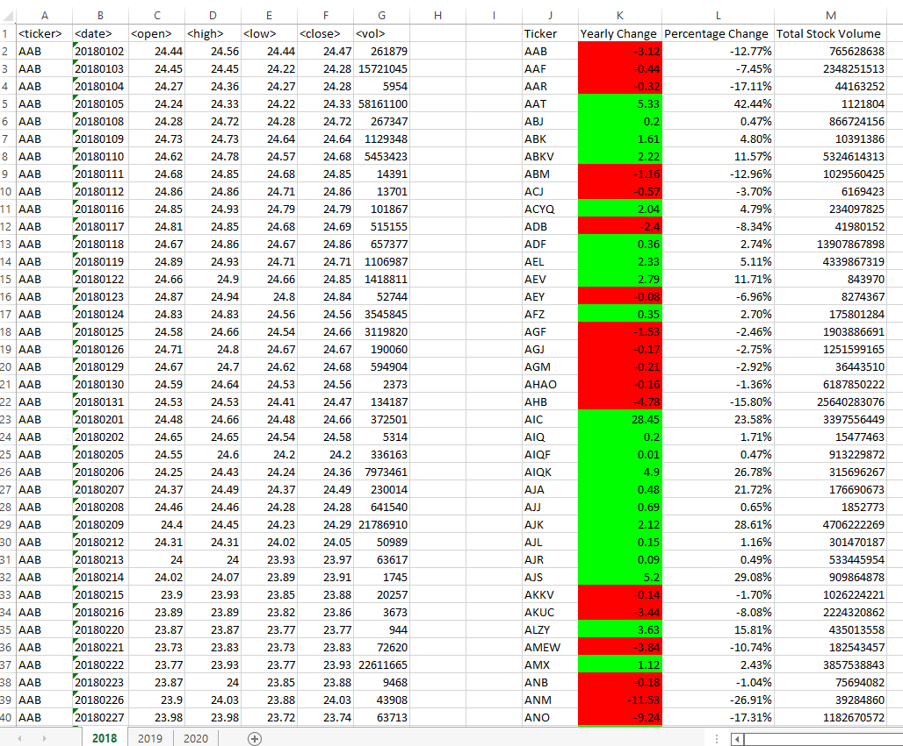
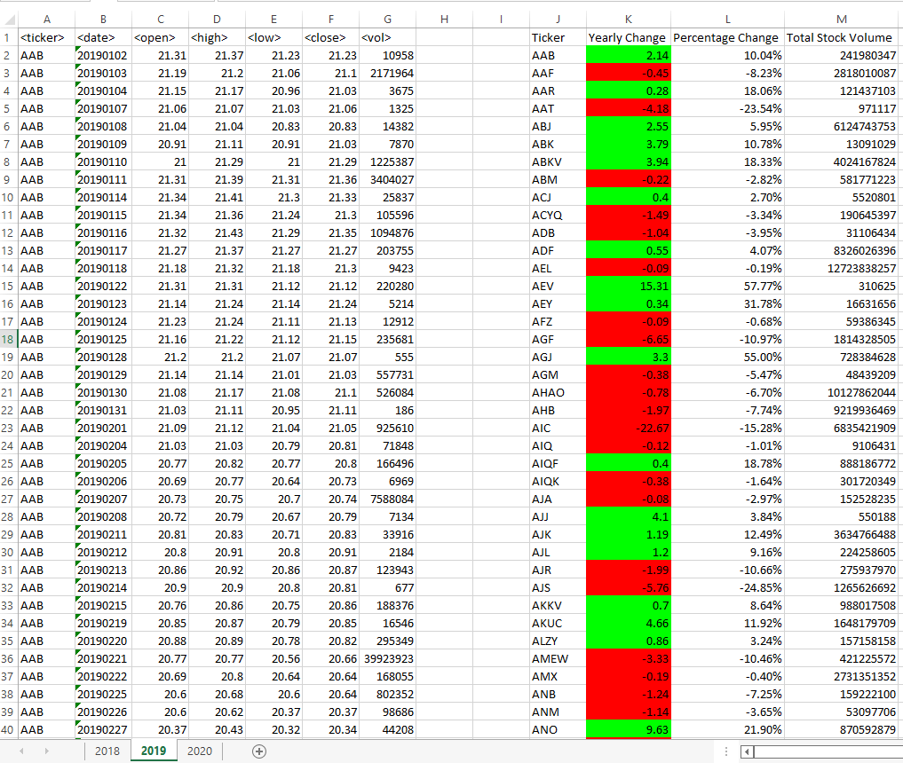
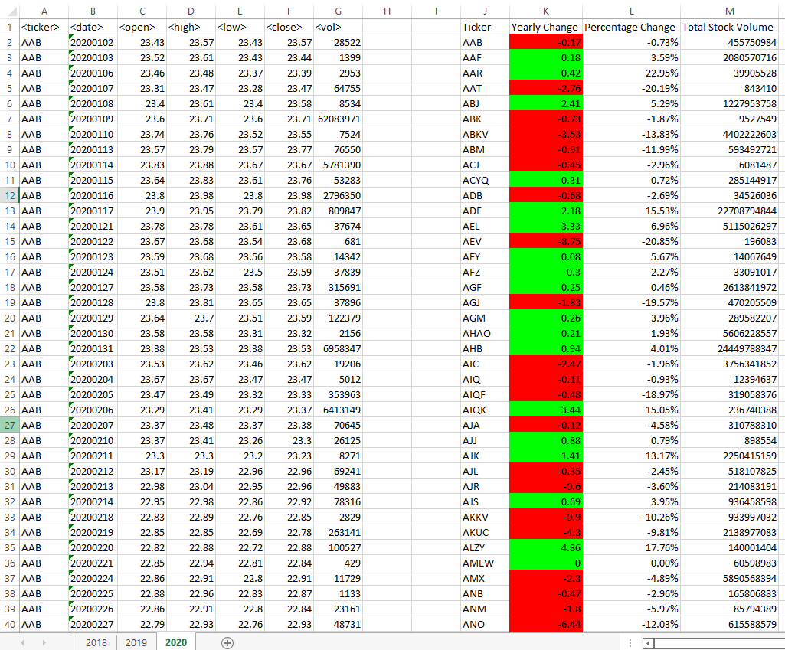

# VBA-Scripting-Challenge
* Using VBA Language to Analyse and Present Data to the User.

## The Objective 
To create a VBA script which when ran analyses stock data. This script will then present data to the user in specified areas of the worksheet.

## Acceptance Criteria

Script must:
* Output The Stock Symbol.
* Calculate And Output The Yearly Change.
* Using Conditional Formatting To Highlight Positive And Negative Yearly Change, Green And Red Respectively.
* Calculate And Output The Percentage Change Of A Given Year Based On Opening And Closing Price Of That Year.
* Total Stock Volume Of Each Stock.

## Functions Used 

Once Ran, the Script runs through a number of preset Variables, Functions including If statements and For Loops, which analyses the data and presents the desired outputs for the user.  

## Further Considerations 
* Adjustments made to the VBA Script allowing it to run on every Worksheet in the WorkBook.

## Deployed GitHub Repository Link

https://github.com/MohammedRizwan-1/VBA-Scripting-Challenge

## Result's 

2018 Results:

2019 Results:

2020 Results:
